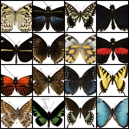
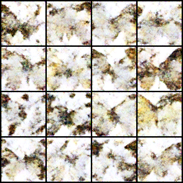

# Pixel-Space Flow Matching For Butterflies

This workspace contains a small flow-matching model that learns to generate
64x64 butterfly images directly in pixel space.

The model trains a velocity field from Gaussian noise `x0` to real image pixels
`x1` using the straight path:

```text
x_t = (1 - t) * x0 + t * x1
target velocity = x1 - x0
```

Sampling starts from random noise and integrates the learned velocity field from
`t=0` to `t=1`.

## Example Images

Training targets:



Current 10-epoch sample:



The current sample is included as an early-training artifact, not a finished
generator result. It needs longer training for recognizable butterfly structure.

## Setup

```bash
source .venv/bin/activate
python -m pip install --upgrade pip
python -m pip install -r requirements.txt
```

## Data

This project is set up for the HugGAN Smithsonian butterflies subset:

https://huggingface.co/datasets/huggan/smithsonian_butterflies_subset

Install dependencies, then download/export it into local image files:

```bash
python scripts/download_butterflies.py
```

By default, images are written here:

```text
data/butterflies/raw/
```

Nested folders are fine. Supported image types are `.jpg`, `.jpeg`, `.png`,
`.webp`, and `.bmp`. Images are loaded as RGB, resized/cropped to 64x64, and
normalized to `[-1, 1]`.

For a quick pipeline test, export only a few rows:

```bash
python scripts/download_butterflies.py --limit 32 --overwrite
```

## Verify

```bash
python scripts/smoke_test.py
```

This verifies PyTorch, the flow-matching loss, a backward pass, and a tiny
sampling run without needing real butterfly images.

## Train

```bash
python scripts/download_butterflies.py
python scripts/train_flow_matching.py \
  --data-dir data/butterflies/raw \
  --epochs 100 \
  --batch-size 16 \
  --base-channels 32 \
  --save-every 10 \
  --sample-every 10 \
  --sample-steps 100
```

Checkpoints are written to `checkpoints/`. Training samples are written to
`outputs/`.

For this setup, 1-10 epochs is only a smoke test. It generally learns the bright
background and dark texture before it learns butterfly structure. Expect to run
at least 50-100 epochs for recognizable 64x64 samples on this small
unconditional pixel-space model.

On CPU this will be slow, so start small while checking that the data pipeline
works:

```bash
python scripts/train_flow_matching.py \
  --data-dir data/butterflies/raw \
  --epochs 2 \
  --batch-size 4 \
  --base-channels 16 \
  --sample-count 4 \
  --sample-steps 20 \
  --checkpoint-dir checkpoints/debug \
  --output-dir outputs/debug
```

## Sample

```bash
python scripts/sample_flow_matching.py \
  --checkpoint checkpoints/latest.pt \
  --output outputs/final_samples.png \
  --num-samples 16 \
  --steps 80
```

## Project Layout

- `src/flow_butterflies/` contains the dataset, model, flow objective, and utilities.
- `scripts/download_butterflies.py` exports the Hugging Face dataset to local images.
- `scripts/train_flow_matching.py` trains the pixel-space model.
- `scripts/sample_flow_matching.py` generates images from a checkpoint.
- `scripts/smoke_test.py` checks that the code runs.
- `data/` is for local datasets.
- `outputs/` is for generated samples.
- `checkpoints/` is for model weights.
